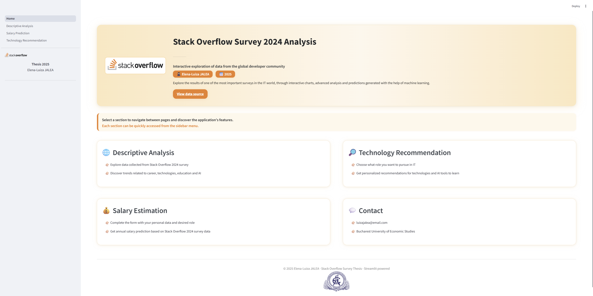

# 💡 Stack Overflow Developer Survey 2024 – Interactive Analysis & ML Predictions


This Streamlit application offers an interactive, visual, and intelligent exploration of the **Stack Overflow Developer Survey 2024** dataset.  
Built as part of a master’s dissertation project, it integrates data analysis and machine learning to extract insights, estimate salaries, and provide career technology recommendations.

---

## 🔗 Live demo

You can try the app live here:  
👉 [https://your-app-name.streamlit.app](https://your-app-name.streamlit.app)

> ⚠️ Note: The app may take a few seconds to load the first time, especially if models or data are being loaded.

---
## 📸 Preview



---

## 🚀 Features

### 📊 Descriptive Analysis

Explore key dimensions such as:
- Demographics (age, country)
- Education and learning methods
- Professional roles and experience
- Technologies used (languages, databases, AI tools)
- Stack Overflow usage patterns
- Job satisfaction and attitudes toward AI

### 💰 Salary Prediction

Estimate your gross annual salary based on:
- Age group, education level, region
- Programming experience & work experience
- Preferred developer role
- Known programming languages

> Uses a trained **CatBoost Regressor** model with real survey data.

### 🤖 Technology Recommendation
###
Receive personalized suggestions of:
- Programming languages
- AI tools 

> Based on your profile and desired professional role. Uses a **multi-label classifier** 

---

## 🛠️ Technology Stack
### Programming Language
- Python 3.13

### Web Framework
- Streamlit 

### Data Processing and Vizualization
- Pandas
- NumPy 
- Altair
- Matplotlib    

### Machine Learning
- CatBoost Regressor – used for salary prediction (regression model)
- MLPClassifier (Neural Network) – used for technology recommendation (multi-label classification)
- Scikit-learn

### Model Persistence and Loading
- joblib – loading the CatBoost model and metadata
- pickle – saving and loading ML models, encoders, scalers, column names, dropdown options, and model comparison results

###  UI and Styling
- Custom CSS injected via ```st.markdown```
- Inline HTML

---
## 🚀 How to Run Locally

### 1. Clone this repository

```bash
git clone https://github.com/your-username/your-repo-name.git
cd your-repo-name
```
### 2. Install required packages

Install all dependencies listed in requirements.txt:
```bash
pip install -r requirements.txt
```

### 3. Launch the Streamlit app

Run the application with: 
```bash
streamlit run Home.py
```

## 📁 Project Structure
```
├── data/
│   └── variabile_preprocesate.csv         ← Preprocessed survey dataset
├── images/
│   └── Home-page.png                       ← Screenshot used in README
├── models/
│   └── *.pkl                               ← Trained ML models & encoders
├── pages/
│   ├── 1_Descriptive_Analysis.py
│   ├── 2_Salary_Prediction.py
│   └── 3_Technology_Recommendation.py
├── Home.py                                 ← Entry point
├── requirements.txt
├── .gitignore
└── README.md
```
## 📌 Notes

- All models are trained using the Stack Overflow Survey 2024 dataset.
- The project does not use a database — all data comes from CSV files.
- All computations are done locally.
- Streamlit Cloud can also be used for free deployment.

## 👩🏻‍🎓 Author
Elena-Luiza JALEA

📧 Email: luizajalea@email.com <br/>
🏫 Institution: Bucharest University of Economic Studies <br/>
📅 Year: 2025

## 📜 License
This project is for educational and non-commercial purposes.
Original data from: Stack Overflow Survey